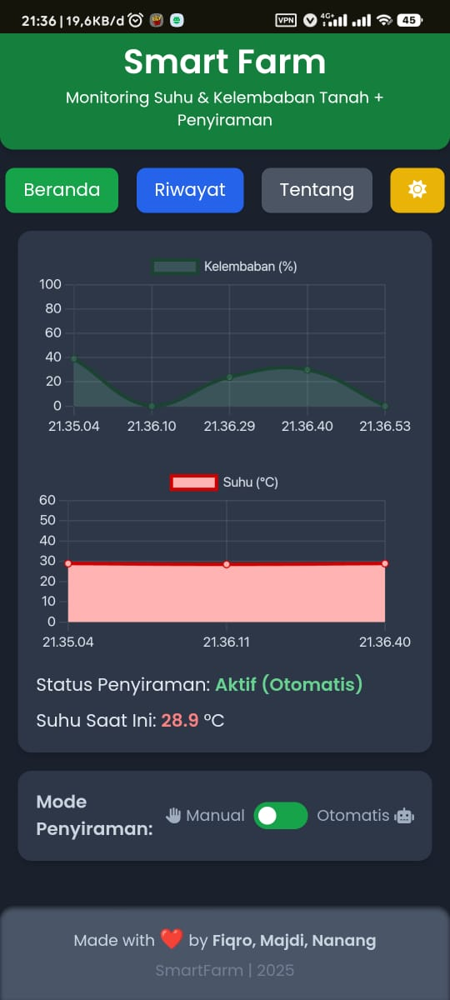
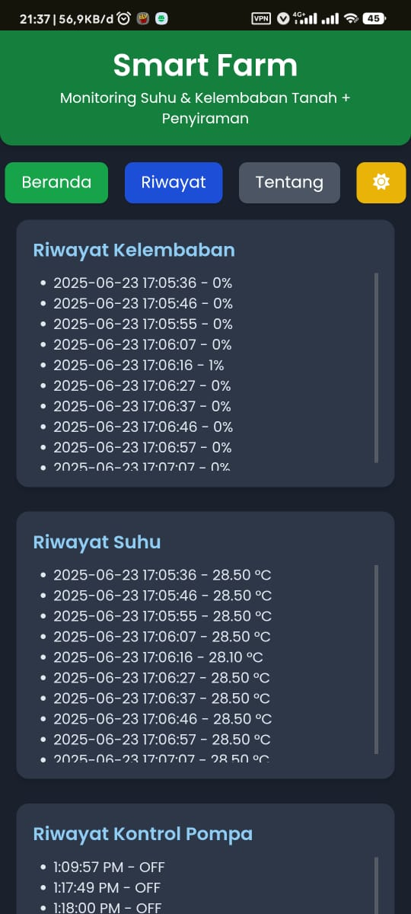
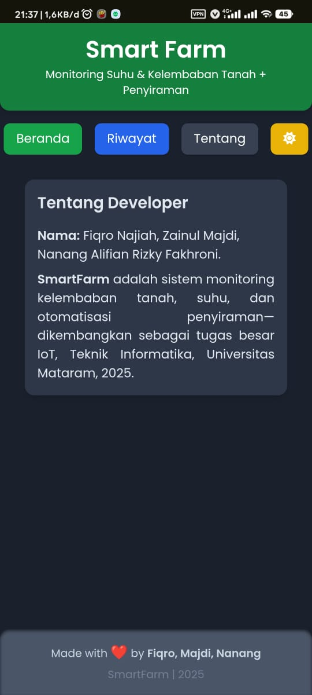

# 🌱 Projek_IoT: Smart Farm – Otomatisasi Pertanian Berbasis IoT

## 📌 Deskripsi Proyek
**Smart Farm** adalah sistem berbasis Internet of Things (IoT) yang dirancang untuk mengotomatisasi proses penyiraman tanaman dan pemantauan kondisi lingkungan pertanian secara real-time. Sistem ini menggunakan berbagai sensor dan mikrokontroler ESP32 untuk mendeteksi kelembapan tanah, suhu, dan kelembaban udara. Pompa air akan aktif secara otomatis berdasarkan data sensor, dan seluruh informasi dapat dipantau melalui platform berbasis web atau cloud.

---

## 🎯 Tujuan

- ✅ Meningkatkan efisiensi penyiraman tanaman dengan pemantauan berbasis sensor.
- ✅ Mengurangi intervensi manual petani dengan proses otomatisasi.
- ✅ Menyediakan sistem monitoring jarak jauh berbasis web atau mobile.

---

## 🧰 Teknologi & Komponen

### 🔌 Perangkat Keras
- ESP32 DevKit V4
- Sensor Kelembapan Tanah (Soil Moisture Sensor)
- Sensor Suhu & Kelembaban Udara (DHT11 / DHT22)
- Sensor Suhu Ruangan (TMP36) *(opsional)*
- Modul Relay 1 channel
- Pompa Air Mini 5V/12V
- Breadboard & Kabel Jumper
- Power Supply (Adaptor / Baterai Li-Ion)

### 💻 Perangkat Lunak
- Arduino IDE
- Firebase / MySQL (jika digunakan untuk database beserta webnya)
- WiFi (untuk konektivitas ESP32)

---

## ⚙️ Cara Kerja Sistem

1. **Pembacaan Sensor:**  
   - Sensor kelembapan tanah mengukur kadar air tanah.
   - Sensor DHT11 membaca suhu dan kelembaban udara.

2. **Logika Otomatisasi:**  
   - Jika kelembapan < ambang batas (misal 30%), maka ESP32 akan mengaktifkan relay untuk menyalakan pompa.
   - Ketika kelembapan tanah mencukupi, pompa akan dimatikan secara otomatis.

3. **Pengiriman Data:**  
   - Data dari semua sensor dikirim secara periodik ke dashboard monitoring berbasis web/cloud.

4. **Monitoring & Kontrol:**  
   - Pengguna dapat memantau kondisi lingkungan dan status pompa dari jarak jauh melalui web atau aplikasi.

---
## 📸 Tampilan Antarmuka Web

Antarmuka web Smart Farm ini dibangun menggunakan Firebase Hosting dan Realtime Database, memungkinkan pengguna memantau kondisi suhu, kelembaban tanah, dan status pompa penyiraman secara langsung. Berikut adalah fitur-fitur utama:

---

### 🟢 Dashboard Utama – Monitoring Real-time

Tampilan utama menampilkan:
- Grafik **Kelembaban (%)** dan **Suhu (°C)** secara real-time.
- Status penyiraman saat ini, misalnya: `Aktif (Otomatis)`.
- Informasi suhu saat ini dalam angka.
- Switch kontrol **mode penyiraman**, yang dapat diatur ke `Manual` atau `Otomatis`.

Fitur ini memungkinkan pengguna untuk mengawasi kondisi tanaman secara cepat dan intuitif.

---

### 📄 Riwayat Monitoring Sensor

Pada menu **Riwayat**, pengguna dapat melihat histori data yang telah tersimpan di Firebase Realtime Database, antara lain:
- Waktu dan nilai **kelembaban tanah**.
- Waktu dan nilai **suhu lingkungan**.
- Riwayat **status pompa** (ON/OFF) berdasarkan waktu.

Ini penting untuk evaluasi pola penyiraman dan kondisi lingkungan tanaman.

---

### 👨‍💻 Tentang Developer

Menu ini menampilkan informasi tentang tim pengembang proyek:
- **Fiqro Najiah**, **Zainul Majdi**, dan **Nanang Alifian Rizky Fakhroni**.
- Keterangan bahwa proyek ini dikembangkan untuk tugas besar mata kuliah IoT di **Teknik Informatika, Universitas Mataram**, tahun **2025**.

Halaman ini juga menjadi identitas proyek dan bentuk penghargaan terhadap kontribusi developer.

---

## 📈 Manfaat Sistem
- 💧 Hemat air dengan penyiraman otomatis berdasarkan kondisi tanah.

- 🌾 Mendukung pertanian modern dan presisi.

- 🌐 Dapat diakses dari mana saja melalui internet.

- 📊 Meningkatkan hasil panen dengan pengawasan lingkungan yang akurat.

## 📃 Lisensi
Proyek ini dirilis dengan lisensi MIT – silakan digunakan, dimodifikasi, dan dikembangkan lebih lanjut untuk kebutuhan edukasi maupun komersial.

## 🙋‍♂️ Kontribusi
Kontribusi sangat terbuka! Jika kamu ingin menambahkan fitur, perbaikan bug, atau dokumentasi, silakan fork repo ini dan ajukan pull request.

